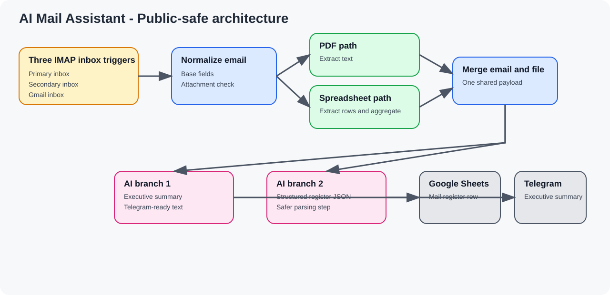

# Mail-and-voice-agent

AI Mail Assistant is the public portfolio version of a historical `n8n` workflow named `Mail Agent`.

It watches several inboxes, reads attachments, creates an executive summary for Telegram, and writes structured mail data to Google Sheets.

This repository is a public-safe version of the project. It includes only real project artifacts that were reviewed for public release.

## Quick Facts

- Focus: inbound email triage and reporting
- Workflow platform: `n8n`
- AI use: executive summary and structured register JSON
- Main outputs: `Telegram` and `Google Sheets`
- Public repo includes: sanitized workflow and focused docs
- Public repo excludes: mailbox details, credentials, live runtime data, and private audit files

## Why This Project Matters

Many teams lose time on incoming email.

The hard part is not only reading the message. The hard part is turning mail and attachments into clear action.

This workflow shows a useful automation pattern:

- read incoming mail from several inboxes;
- detect whether an attachment exists;
- extract text from PDF and spreadsheet files;
- create a short executive summary for Telegram;
- create structured fields for a mail register in Google Sheets.

## Current Project Status

The public workflow was prepared from real historical materials.

The audited environment did not prove a fresh successful end-to-end live run in its current state, because mailbox credentials were incomplete at audit time.

This repository shows the real workflow design and the hardening work. It does not claim current live validation beyond what the historical audit proved.

## What The Workflow Does

### 1. Intake

The historical `Mail Agent` workflow uses three IMAP inbox triggers.

### 2. Email And Attachment Processing

The workflow:

- normalizes base email fields;
- checks whether an attachment exists;
- routes spreadsheet files into extraction and row aggregation;
- routes PDF files into text extraction;
- merges email data with extracted attachment content.

### 3. Two AI Outputs

After merge, the workflow creates two different outputs:

- an executive summary for Telegram;
- a structured JSON object for the mail register.

### 4. Final Delivery

The summary goes to Telegram.

The structured data goes to Google Sheets.

## Architecture At A Glance



Simple flow:

1. The workflow starts from multiple inbox triggers.
2. It reads the email and optional attachment.
3. It builds a short human summary.
4. It also builds structured register fields.
5. Telegram gets the summary. Google Sheets gets the register row.

## Confirmed Attachment Handling

The public-safe workflow confirms these real paths:

- email metadata normalization;
- PDF text extraction;
- spreadsheet extraction;
- attachment-aware routing;
- row aggregation for spreadsheet content.

## Confirmed Structured Output

The historical GitHub-ready workflow writes structured fields such as:

- `Date`
- `From`
- `Subject`
- `Category`
- `Priority`
- `DocumentType`
- `Organization`
- `Amount`
- `Summary`
- `Deadline`
- `Status`
- `ReplyStatus`
- `WorkStatus`
- `Comment`

## Confirmed Hardening Work

The historical audit confirms these GitHub-ready changes:

- the broken `Google Sheets -> Telegram` path was removed;
- the register mapping was expanded with workflow-management fields;
- JSON parsing for AI output was made safer;
- node names were cleaned for readability;
- private IDs and runtime-specific values were removed or replaced.

## Real Artifacts In This Repo

- [Sanitized Mail Agent workflow](n8n/ai-mail-assistant.workflow.json)
- [Docs guide](docs/README.md)

## Documentation

Recommended reading order:

1. [Docs Guide](docs/README.md)
2. [Architecture](docs/architecture.md)
3. [Deployment](docs/deployment.md)
4. [Security](docs/security.md)
5. [Roadmap](docs/project-roadmap.md)

## Repository Structure

```text
ai-mail-assistant/
|- README.md
|- .gitignore
|- LICENSE
|- docs/
|  |- README.md
|  |- architecture-diagram.svg
|  |- architecture.md
|  |- deployment.md
|  |- project-roadmap.md
|  `- security.md
`- n8n/
   `- ai-mail-assistant.workflow.json
```

## Public-Safe Scope

This repository includes only materials that are both real and safe to publish:

- a sanitized workflow export;
- focused project documentation based on confirmed artifacts.

This repository does not include:

- personal mailbox addresses;
- passwords, tokens, or API keys;
- real Telegram chat IDs;
- real Google Sheet IDs or URLs;
- `.env` files;
- live runtime dumps or infrastructure details.

## Why This Repo Works As A Portfolio Piece

For a hiring manager, the value is not only that the workflow reads email.

The value is the design around it:

- multi-inbox intake;
- attachment-aware routing;
- two different AI outputs from the same source email;
- structured business logging;
- honest public packaging of a real project.

## Current Boundaries

This public repository does not claim more than the source materials prove.

It does not include mailbox setup, private audit notes, or full live validation evidence from the audited environment.
